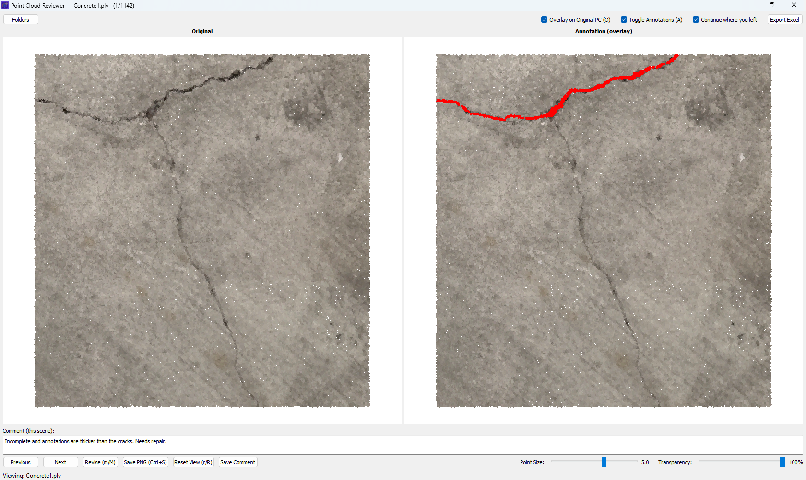

# Point Cloud Reviewer (PyQt5 + PyVista)

Dual‑view, GPU‑accelerated reviewer for 3D point clouds (PLY / PCD). Load your “Original” dataset on the left and the corresponding “Annotation” on the right, then toggle between “Overlay on Original” and “Annotation as‑is” views. The app persists folders, last position, and per‑scene comments, and can export a consolidated Excel report.



---

## Highlights

- Fast rendering on millions of points using PyVista (OpenGL/VTK) with compact UI
- Side‑by‑side view with synchronized camera (rotate/pan/zoom mirrored)
- Overlay mode: render red annotation points on top of the original cloud
- Transparency: controls the transparency of the annotations
- As‑is mode: show the annotation cloud, with red points drawn above others
- Views: shows the top, bottom, front, back, left, right and SW, SE, NW, NE isometric views with their shortcuts
- Per‑scene comments stored locally; export to Excel
- Progress indicator and “Revise” workflow (move files to revision folders)
- Natural filename sorting; continues where you left off across sessions
- Composite screenshot export (PNG) of both canvases
- Loop button to loop through the point cloud with delay timer
- Jump to text box with input point cloud index
- Left navigation pane with thumbnails for a quick view

---

## Contents

1. Overview & Data Model
2. Installation
3. Quick Start
4. Choosing Folders & File Matching
5. Using the Viewer
6. Shortcuts
7. Comments & Excel Export
8. Progress & Revise Workflow
9. Persistence & Local Storage
10. Rendering Details & Performance
11. PNG Screenshots
12. Packaging as an Executable (optional)
13. Troubleshooting & FAQ
14. Contributing
15. License

---

## 1) Overview & Data Model

This reviewer is designed for datasets where each annotated point cloud corresponds to an original point cloud of the same basename (stem). For example:

- Original: `C:\\data\\orig\\scene_0001.ply`
- Annotation: `D:\\data\\anno\\scene_0001.ply`

The app builds its file list from your Annotation folder(s), and for each annotation’s stem (`scene_0001`) it will look for the matching Original in the Original folder(s). You can configure multiple folder roots for Original, Annotation, and Revise; the app supports multi‑selection and ordering.

Supported formats: `.ply`, `.pcd` (binary or ascii is handled by Open3D).

Color convention for “red annotations” (overlay filter):

- A point is considered “red” if: `R = 1.0` and `G = 0.0` and `B = 0.0` (with colors normalized to [0,1]).

---

## 2) Installation

### Requirements

- Windows 10/11, Linux, or macOS (primary development on Windows)
- Python 3.9–3.12 recommended
- GPU/driver supporting OpenGL (PyVista uses OpenGL via PyQt5)
- For Windows + Open3D: Microsoft Visual C++ Redistributable (2015–2022) may be required

### Dependencies (runtime)

- PyQt5
- pyvista
- VTK
- open3d
- numpy
- pandas (for Excel export)
- openpyxl (Excel writer)
- pillow (PNG save)
- tqdm (console progress bar)

A ready‑to‑use `requirements.txt` is included.

### Install with a virtual environment (PowerShell)

```pwsh
# From the repository root
python -m venv .venv
.\.venv\Scripts\Activate.ps1
python -m pip install --upgrade pip
pip install -r .\python\requirements.txt
```

---

## 3) Quick Start

```pwsh
# From the repository root
.\.venv\Scripts\Activate.ps1
python .\python\app.py
```

- Click “Folders” and select your Original, Annotation, and Revise folders.
- Use Next/Previous (→/←) to review files.
- Toggle “Overlay on Original PC (O)” to switch modes.
- Toggle “Toggle Annotations (A)” to show/hide red points when overlaying.
- Add comments and click “Save Comment”, or export to Excel at any time.
- Press Ctrl+S to save a side‑by‑side PNG snapshot.
- Loop through point clouds using the loop button
- Jump to point cloud using **Input PC Index and Press Enter** text box

---

## 4) Choosing Folders & File Matching

Open the “Folders” dialog to configure three lists:

- Original Folders (left view source)
- Annotation Folders (drives the master file list)
- Revise Folders (destination(s) when you mark a file for revision)

Notes:

- You can multi‑select directories within the dialog; the app deduplicates and preserves order.
- Filenames are matched by basename (stem) only. If multiple Originals exist across roots, the first match wins.
- The Revise workflow maps a moved annotation file from its Annotation root i to the Revise root i (same index). Keep the Annotation and Revise lists aligned 1:1 in order and length.
- When no `*.ply`/`*.pcd` annotations are found in selected folders, you’ll be prompted to pick again.

---

## 5) Using the Viewer

- Left canvas: Original cloud.
- Right canvas:
  - Overlay mode: Original as base + red points from Annotation drawn on top.
  - As‑is mode: Annotation cloud split into non‑red (base) and red (overlay) so red draws above.
- Views: shows the top, bottom, front, back, left, right and SW, SE, NW, NE isometric views with their shortcuts
- Camera is synchronized across canvases. Rotate/pan/zoom on either side and the other follows.
- Mouse wheel zoom is anchored at the cursor (AutoCAD‑style): hold Ctrl for coarse, Shift for fine steps.
- Point Size slider updates instantly on both canvases.
- Reset View returns to top‑down orthographic fit.
- Left navigation pane with thumbnails for a quick view

---

## 6) Shortcuts

- O: Toggle “Overlay on Original PC”
- A: Show/Hide red annotations (only affects the overlay/annotation top layer)
- R: Reset view (top‑down fit)
- M: Move current annotation file to the corresponding Revise folder
- ← / →: Previous / Next file
- Ctrl+S: Save composite PNG (both canvases side‑by‑side)
- Ctrl+T: Top view
- Ctrl+B: Bottom view
- Ctrl+F: Front view
- Ctrl+V: Back view
- Ctrl+L: Left view
- Ctrl+R: Right view
- Ctrl+W: SW Isometric view
- Ctrl+E: SE Isometric view
- Ctrl+I: NW Isometric view
- Ctrl+O: NE Isometric view
- N: Toggle navigation

All toggles work outside text inputs with plain keypress, or anywhere with Shift+key.

---

## 7) Comments & Excel Export

- Each stem has its own free‑text comment. Use the “Save Comment” button to persist (autosaves on navigation and before export).
- Export Excel creates a workbook with columns:
  - filename (stem)
  - comment
  - has_comment (boolean)
  - annotations_count (only meaningful in overlay mode)
  - annotations_class ("crack" if any red points exist, else "none")
- The last export directory is remembered for convenience.

---

## 8) Progress & Revise Workflow

- The title shows the current file and position (e.g., `scene_0007.ply (8/120)`).
- A console progress bar (tqdm) advances the first time you view each stem.
- Clicking “Revise (m/M)” moves the current annotation file from its Annotation root to the corresponding Revise root (same index), updates the in‑memory list, and continues.
- When all files are reviewed, the app notifies and exits.

Caveat: Ensure the Revise folder exists and that the Annotation and Revise lists are aligned. The app will create missing Revise directories if needed but needs a matching index.

---

## 9) Persistence & Local Storage

State files live under your platform’s local app data directory:

- Windows: `%LOCALAPPDATA%/Point Cloud Reviewer/`

Files:

- `settings.json` — folder lists, overlay preference, last export path, “continue where left” flag, last stem and index.
- `comments.json` — mapping of `stem -> comment`.

Settings highlights:

- Continue where left: on launch, the app jumps back to the last stem if it still exists; otherwise falls back to last index or start.
- Overlay preference is remembered across runs.

---

## 10) Rendering Details & Performance

- Renderer: PyVista Markers visuals (OpenGL/VTK) for very fast point drawing.
- Synchronized cameras: two Turntable cameras kept in lockstep.
- Zoom: anchored at cursor with orthographic scale adjustment (fov=0) or distance change (perspective fallback).
- Views: shows the top, bottom, front, back, left, right and SW, SE, NW, NE isometric views with their shortcuts.
- Automatic decimation: point clouds are randomly subsampled to `MAX_PTS = 2_000_000` for interactivity.
- Marker scale: controlled by the Point Size slider.
- Transparency: controlled by the Transparency slider

Tunable constants (edit in `app.py`):

- `ALLOWED_EXT = (".ply", ".pcd")`
- `MAX_PTS = 2_000_000`
- `COMMENT_BOX_HEIGHT = 40`
- `SLIDER_WIDTH_PX = 180`
- `MARKER_SCALE = 1.0`

Tips:

- Reduce point size on dense scenes to avoid overdraw.
- Keep GPU drivers up to date for best OpenGL stability.

---

## 11) PNG Screenshots

- Ctrl+S saves a composite PNG named `<stem>.png` in the current working directory.
- The image contains both canvases side‑by‑side; smaller canvas is padded to match height.

---

## 12) Packaging as an Executable (optional)

You can bundle the app with PyInstaller. PyVista and Open3D require some care:

- Include the Qt plugins and PyVista assets; PyInstaller hooks generally handle this, but you may need to collect data.
- Open3D wheels are large and ship many binaries; ensure they’re included.

Example (adjust as needed):

```pwsh
pyinstaller --noconfirm `
  --onedir `
  --noconsole `
  --windowed `
  --name "Point Cloud Reviewer" `
  --icon .\python\app.ico `
  --add-data ".\python\icon.png;." `
  --add-data ".\python\app.ico;." `
  .\python\app.py
```

Common packaging issues:

- Missing Qt plugins on target machine → ensure PyQt5 plugins are bundled.
- OpenGL context errors → update GPU drivers; test on target hardware.

---

## 13) Troubleshooting & FAQ

- Blank or white canvases

  - Cause: OpenGL context issues or outdated GPU drivers.
  - Fix: Update graphics drivers; verify OpenGL support; try a simpler PyVista example.
- Open3D import errors on Windows

  - Cause: Missing MSVC redistributables.
  - Fix: Install “Microsoft Visual C++ Redistributable for Visual Studio 2015–2022”.
- “Folders” multi‑select doesn’t add all selections

  - Tip: Use the non‑native dialog provided; you can select multiple items in the list/tree and the app collects them. Duplicates are ignored case‑insensitively on Windows.
- Revise doesn’t move files

  - Cause: Annotation and Revise lists misaligned.
  - Fix: Ensure the i‑th Annotation root maps to the i‑th Revise root.
- Excel export missing counts

  - Note: `annotations_count` is only computed in Overlay mode and counts points matching the red mask.
- Where are settings/comments stored?

  - `%LOCALAPPDATA%/Point Cloud Reviewer/` (Windows) — see section 9.

---

## 14) Contributing

- Issues and PRs are welcome. Keep changes focused and include screenshots for UI changes.
- Follow PEP 8; prefer small, well‑scoped commits.
- Avoid introducing heavyweight dependencies unless necessary.

---

## 15) License

This project is licensed under the MIT License — see `../LICENSE`.

---

## Appendix: What’s in the Code (quick tour)

- `python/app.py`

  - PyQt5 main window with top controls, dual PyVista canvases, and bottom panel.
  - Folder dialog with multi‑select lists for Original/Annotation/Revise and reordering.
  - PyVista dual canvas (`DualCanvasPyVista`): synchronized cameras, anchored zoom, split overlay pipeline.
  - File discovery: annotation list drives iteration; originals located by stem across Original roots.
  - Persistence: `settings.json` and `comments.json` under Local AppData.
  - Export: Excel via pandas/openpyxl; PNG composite via Pillow; progress via tqdm.
- `python/icon.png`, `python/app.ico`

  - Application icons for desktop packaging.
- `assets/overview_01.png`

  - Overview image used in this README.
